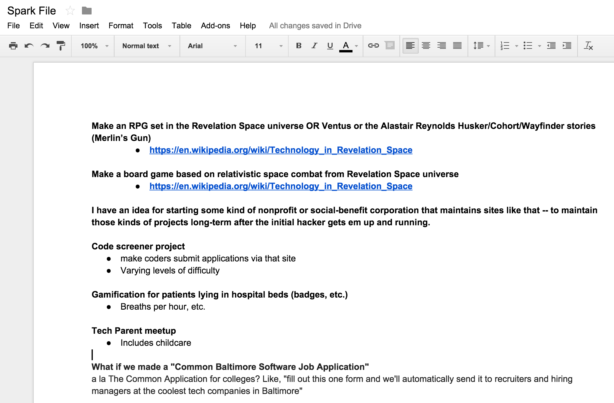

# Going Faster:
# Productive Programming Tips
By Mike Subelsky (@subelsky)

---
# Coding Speed

* Write clean / modular code
* Write lots of tests at all levels of granularity
* Many small classes, few private methods, few class methods
* Local git overrides
* Outside-in / BDD
* Coding spikes

---
# sampling.rake spike example
```ruby
copy_template = <<-SQL
COPY %<table_name>s (%<column_names>s)
FROM STDIN
(NULL '',
DELIMITER E'\\t')
SQL

s3 = Aws::S3::Resource.new
bucket = s3.bucket("staqcollection-test")

#puts "\n\nCreating #{tables_to_create.size} tables...\n\n"

samples_to_load.each do |table_name,(sql,column_names)|
sql = sql.gsub(/\s+--.+/,"")
sql.gsub!(/VARCHAR\(MAX\)/,"TEXT") # super hack here because of how StaqRedshift::DBType() works
sql << ");"
puts sql

puts "Creating #{table_name}"

replica_postgres.exec "DROP TABLE IF EXISTS #{table_name};"

replica_postgres.exec(sql) do |result|
  puts "\tCreated #{table_name}"
end

#Dir.mktmpdir do |tmp_dir|
tmp_dir = Dir.mktmpdir
tmp_dir = Pathname(tmp_dir).join(table_name).tap(&:mkdir)

bucket.objects({
  prefix: "#{sampling_prefix}/#{table_name}"
}).each do |object|
  next if object.content_length <= 20 # Some tables aren't distributed correctly and so end up dumping no data from most slices
  url = object.presigned_url(:get)
  filename = tmp_dir.join(Pathname(url).basename.sub(/\?.+/,""))
```
---

# Command-line Speed

* Tab-completion
* Ack (and cousins)
* Bash command-line (Ctrl-A/Ctrl-E/!!)
* Learn one new shortcut per day
    * Sticky note
* iTerm tabs and windows (one project per tab)
* Make it easy to add aliases (ea command)

---

# Example Aliases
```bash
rs  # rspec spec
m.  # Open MacVim in current project
ou  # Open latest github commit
gar # Stage all changes in git
gg  # commit changed
gc  # commit staged
gs  # status
```

---

# Example Aliases
```bash
gb  # show git branch
gco # checkout
gsp # git stash pop
gl  # git pull
gh  # show me HEAD SHA-1
ghc # copy HEAD SHA-1 to clipboard
```

---

# Example Aliases
```bash
ps? # grep process list
bc  # bin/console
rc  # rails console
h   # heroku
hrr # heroku run rake
r   # rake
```

---

# Editor speed

* I like Vim
* One project per tab
* Leave tabs open
* Learn one new shortcut per day
* ml script

---

# OS X Speed

* Alfred demo
* Preview PDF signing
* GitX

---

# Email Hacks

* "Moving you to BCC"
* Double opt-in intros
* Separate email address for grey mail

---

# General Productivity Hacks

* Saying No
* Strunk and White
* Inbox Zero
* GTD
    Breaking down a project into super small tasks
    Putting different contexts on projects
* Things app

---

# General Productivity Hacks


---

# General Productivity Hacks

* Weekly review
* FancyHands
* "Do a little bit every day"
* Favor long-form social media
    * Blogs
    * Newsletters
    * Podcasts

---

# General Productivity Hacks
## Spark File



## [More Details](https://medium.com/the-writers-room/the-spark-file-8d6e7df7ae58)

---

# My number one super productivity hack...

---

# RELENTLESS COMMITTMENT TO GETTING BETTER, FASTER, STRONGER EVERY DAY

---

# [fit] Questions?

---

# Work with us!
# [fit] programmerswanted@staq.com

